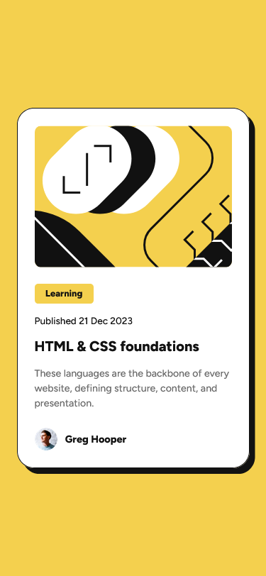
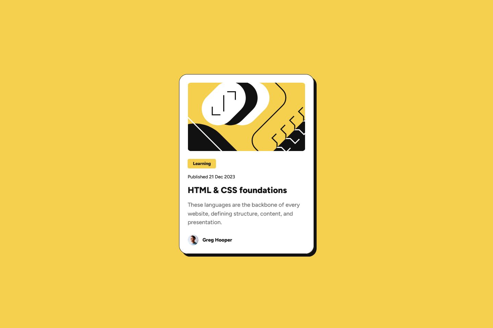

# Frontend Mentor - Blog preview card solution

This is a solution to the [Blog preview card challenge on Frontend Mentor](https://www.frontendmentor.io/challenges/blog-preview-card-ckPaj01IcS). Frontend Mentor challenges help you improve your coding skills by building realistic projects. 

## Table of contents

- [Overview](#overview)
  - [The challenge](#the-challenge)
  - [Screenshot](#screenshot)
  - [Links](#links)
- [My process](#my-process)
  - [Built with](#built-with)
  - [What I learned](#what-i-learned)
  - [Continued development](#continued-development)
- [Author](#author)
- [Acknowledgments](#acknowledgments)


## Overview

### The challenge

Users should be able to:

- See hover and focus states for all interactive elements on the page

### Screenshot




### Links

- Solution URL: [Add solution URL here](https://github.com/ashkir004/blog-preview-card-main)
- Live Site URL: [Add live site URL here](https://ashkir004-blog-preview-card-main.netlify.app/)

## My process

### Built with

- Semantic HTML5 markup
- CSS custom properties
- Flexbox
- Mobile-first workflow

### What I learned

- liked `object-fit:cover`

```css
.card-image {
    width: 100%;
    height: 12.5rem;
    margin: 0;
    object-fit: cover;
    border-radius: 1rem;
    margin-block-end: 1.2rem;
}
```

### Continued development

Use this section to outline areas that you want to continue focusing on in future projects. These could be concepts you're still not completely comfortable with or techniques you found useful that you want to refine and perfect.

- Learn how to use CSS Custom Properties effectively
- Mobile-first workflow (work-in-progress)


## Author

- Frontend Mentor - [@ashkir004](https://www.frontendmentor.io/profile/ashkir004)
- Github - [@ashkir004](https://www.github.com/ashkir004)


## Acknowledgments

- [Frontendmentor.io](https://www.frontendmentor.io)